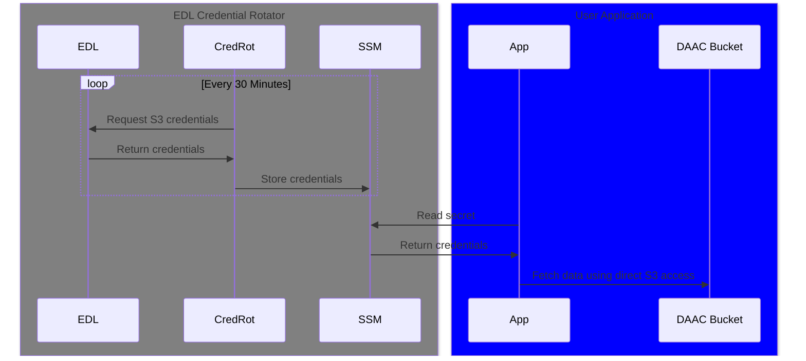

# edl-credential-rotation

AWS CDK Construct to update a SecretsManager secret with new Cumulus Distribution API
[temporary S3 credentials](https://nasa.github.io/cumulus-distribution-api/#temporary-s3-credentials) every 30 minutes.

## Usage

Refactoring the S3 credential acquisition and refresh process into a dedicated service and persisting
the retrieved credentials into SecretsManager allows APIs, pipelines, or other processes to access DAAC S3 resources
without overwhelming the DAAC credentials resource.

See `examples/app.py` for an example CDK application using the `EarthdataCredentialCache` construct.

The system deployed by this construct looks like,



Once the S3 credentials are stored in SecretsManager they may be retrieved in a number of different ways. AWS
provides documentation on secret retrieval in their documentation,
https://docs.aws.amazon.com/secretsmanager/latest/userguide/retrieving-secrets.html

For example,

- AWS Lambda functions should retrieve the secret as part of function ["static initialization"](https://docs.aws.amazon.com/lambda/latest/dg/lambda-runtime-environment.html#static-initialization).
  This ensures that the secret is only retrieved once rather than for each invocation.
  - AWS also provides a ["SecretsManager extension" layer](https://docs.aws.amazon.com/lambda/latest/dg/with-secrets-manager.html) to fetch and cache secrets
- For short running AWS Batch jobs you can configure the "secrets" as part of the JobDefinition. AWS Batch will manage fetching the secret and injecting it into the container as an environment variable.
- Long lived user applications might have a singleton that fetches the secret, caches it, and manages re-fetching the secret before it expires.

## Development

### Requirements


- Python>=3.9
- Docker
- [uv](https://docs.astral.sh/uv/getting-started/installation/)
- aws-cli
- An IAM role with sufficient permissions for creating, destroying and modifying the relevant stack resources.

To begin, install developer and application dependencies using `uv`,

```
$ uv sync --all-groups
```

Then run the following to install the project's pre-commit hooks

```
$ pre-commit install
```

## Linting, formatting, and type checks

This project uses `ruff` for lint/formatting and `mypy` for type checks,

```
$ scripts/format
$ scripts/lint
$ scripts/typecheck
```

## Tests

To run unit test for the credential rotation Lambda function,

```
scripts/test
```
